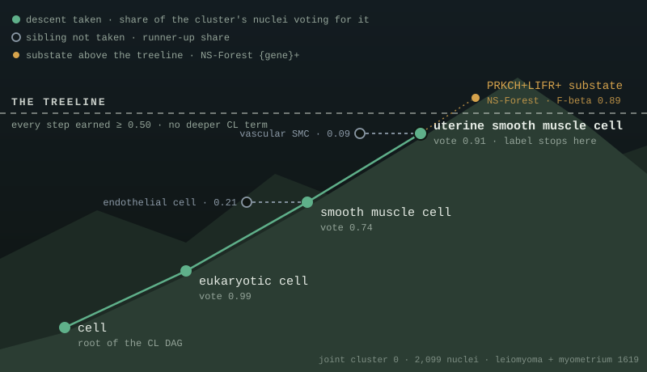

# treeline

*The treeline is the elevation past which conditions stop supporting growth. This tool
descends the Cell Ontology only as far as the evidence supports, then stops.*

<p align="center"></p>

<p align="center"><sub>A real cluster from the dev data. A label is a <i>path</i>, not a leaf: each step is a vote among sibling subtrees and is taken only while the winner's share clears 0.50. Grey siblings are the runners-up the evidence didn't support; ochre is what grows above the line — a substate the ontology has no term for, named by its markers. A neighbouring cluster whose nuclei split 0.48 smooth-muscle / 0.45 endothelial stops at <code>eukaryotic cell</code> instead of being confidently mislabeled.</sub></p>

Multi-level cell type annotation for single-cell / single-nucleus RNA-seq, plus
label-aware integration. A cluster's label is a **path through the Cell Ontology (CL)**,
earned one level at a time — `eukaryotic cell > smooth muscle cell > uterine smooth muscle
cell` — rather than a flat leaf label. Descent stops when the marker evidence stops
supporting it, and what lives *above* the treeline (substates the ontology has no term
for) gets a data-driven `{GENE}+` name from NS-Forest.

No reference atlas, no trained classifier. Inputs are your clustered AnnData and a
CL-labeled gene-set table (CellGuide's per-tissue export works as-is).

**Why.** Flat marker voting fails in a characteristic way: sibling panels split votes
(pericyte vs SMC, T vs NK vs macrophage) and you get confidently-wrong leaf labels.
treeline pools votes up the ontology (subtree-max), so siblings reinforce their parent
instead of cannibalizing each other, and only descends into a child when a vote-share
threshold is cleared and the sibling panels are actually discriminable. Every influence
on a label is one of three things — an ontology fact, a self-reporting automated rule,
or a signed expert override — and none of them is silent.

Status: proof of concept. Built and validated on uterine leiomyoma/myometrium snMultiome;
other tissues and ontologies are untested. See `SPECS.md` for the full design.

## Installation

Requires Python ≥ 3.11. Not on PyPI yet — install from GitHub:

```bash
pip install "treeline[integrate] @ git+https://github.com/brandonlukas/treeline.git"
```

Drop `[integrate]` if you only want annotation (it pulls in scvi-tools / torch for the
scANVI integration step). For development:

```bash
git clone https://github.com/brandonlukas/treeline.git && cd treeline
python -m venv .venv && .venv/bin/pip install -e ".[integrate,dev]"
.venv/bin/pytest
```

## Quickstart

You need two things treeline does **not** make for you:

1. **A clustered, log-normalized AnnData.** Cluster however you like (Leiden, whatever) —
   treeline just reads categorical `.obs` columns. Keep raw counts in
   `layers["counts"]` if you plan to integrate. Use ambient-corrected counts (CellBender);
   on uncorrected nuclei, ambient transcripts from the dominant cell type flip marker
   votes in minority populations.
2. **A gene-set CSV with CL term names.** On [CELLxGENE CellGuide](https://cellxgene.cziscience.com/cellguide),
   open your tissue and "export gene set annotations". Any CSV with `Gene Set Name` /
   `Gene Symbol` columns and CL-labeled set names works.

Then:

```bash
# 1. Once per gene-set table: resolve the CL labels against EBI OLS4 and freeze the DAG.
#    Needs network; everything after this is offline and reproducible.
treeline derive-tree uterus_gene_sets.csv cl_dag.json

# 2. Annotate. Cheap — pass every clustering resolution you have.
treeline annotate sample.h5ad --dag cl_dag.json --gene-sets uterus_gene_sets.csv \
    --clusters leiden_0.5 leiden_1.0 leiden_2.0 -o sample_annotated.h5ad

# 3. Look at it.
treeline summary sample_annotated.h5ad
treeline report  sample_annotated.h5ad -o report.html   # interactive coarse→fine slider
```

`summary` prints each cluster's path with the vote share at every level, plus any gate
refusals or overrides that shaped it:

```
leiden_2.0 — 22 clusters
    0   2,099  eukaryotic cell 99% > smooth muscle cell 74% > uterine smooth muscle cell 91%  [PRKCH+LIFR+ Fbeta 0.892 PPV 0.973 recall 0.67]
    4   1,613  eukaryotic cell 94% > connective tissue cell 57% > stromal cell 91% > fibroblast 58%  [ZBTB16+ Fbeta 0.805 PPV 0.948 recall 0.501]
    1     757  eukaryotic cell 99% > endothelial cell 69% > endothelial cell of lymphatic vessel 84%  [CCL21+EFNA5+ Fbeta 0.88 PPV 0.993 recall 0.604]
    6     717  eukaryotic cell 99%  [MIR99AHG+ Fbeta 0.884 PPV 0.891 recall 0.858]
```

(Cluster 6 stopped at the root: nothing below cleared the descent threshold, so it is
`Unknown` to the integration prior — and NS-Forest still found what distinguishes it.)

The annotated `.h5ad` is self-contained: per-nucleus labels in
`obs["treeline_<cluster_key>"]`, per-cluster calls / shares / refusals in
`uns["treeline"]` (a JSON string — decode with `treeline.annotations(adata)`).

### Substates and integration

```bash
# NS-Forest {GENE}+ names for clusters that collapsed under one label.
# The costly step — run it once, on the resolution you settle on.
treeline substates sample_annotated.h5ad --clusters leiden_2.0 -o sample_annotated.h5ad

# Two or more annotated samples -> scANVI latent, supervised by the tree-cut labels.
treeline integrate a_annotated.h5ad b_annotated.h5ad -o joint.h5ad
```

`integrate` writes the joint latent to `obsm["X_treeline"]` and stops. Recluster it
yourself, then send the joint object back through `annotate` — same vote, same rules,
now on cross-sample clusters:

```python
import scanpy as sc
from treeline.annotate import annotate, add_substates
from treeline.tree import load

joint = sc.read_h5ad("joint.h5ad")
sc.pp.neighbors(joint, use_rep="X_treeline")
sc.tl.umap(joint)
sc.tl.leiden(joint, resolution=2.0, key_added="leiden_2.0", flavor="igraph")

annotate(joint, load("cl_dag.json"), "uterus_gene_sets.csv", ["leiden_2.0"])
add_substates(joint, ["leiden_2.0"])
joint.write_h5ad("joint_annotated.h5ad")
```

```bash
treeline colors joint_annotated.h5ad -o palette.json   # hierarchical palette: same parent, same hue
treeline report a_annotated.h5ad b_annotated.h5ad joint_annotated.h5ad -o report.html
```

## Python API

Every CLI verb is one function; the drivers in `apps/` are worked examples. The
`annotate`/`tree` functions below are also re-exported from `treeline` itself.

| verb | function | notes |
|---|---|---|
| `derive-tree` | `treeline.tree.derive(set_names)` / `load(path)` | `set_names_from_csv(csv)` reads the CellGuide export |
| `annotate` | `treeline.annotate.annotate(adata, dag, gene_sets_csv, cluster_keys, overrides=None, **params)` | mutates and returns `adata` |
| `substates` | `treeline.annotate.add_substates(adata, cluster_keys)` | requires a previously annotated `adata` |
| `integrate` | `treeline.scanvi.integrate({name: adata, ...}, **params)` | returns the joint AnnData |
| `colors` | `treeline.colors.palette(*annotations)` | `annotations(adata)` decodes `uns["treeline"]` |
| `report` | `treeline.report.render_report(paths, out)` | static HTML, no server |

Helpers: `treeline.annotate.coarse_labels(adata, key)` (the class below the DAG root),
`treeline.tree.subdag(dag, root)` (restrict the DAG to one class's subtree — see below).

### Tuning knobs

All named keyword parameters with loud defaults; also CLI flags.

| parameter | default | what it does |
|---|---|---|
| `n_markers` | 10 | top genes taken from each gene set |
| `descend_agree` | 0.5 | vote share a child needs before the cluster descends into it |
| `gate_overlap` | 0.5 | discriminability gate: refuse a descent whose sibling panels share ≥ this fraction of exclusive genes **and** … |
| `gate_score_r` | 0.9 | … whose per-nucleus scores correlate ≥ this (both must trip; the refusal reports both numbers) |
| `supervise_depth` | 2 | integrate: truncate labels at this depth for the scANVI prior |
| `classification_ratio` | 50 | integrate: label pull vs batch mixing |

## Advanced usage

### Per-class refinement (the recipe treeline deliberately leaves to you)

Global HVGs and a global latent are spent on *between*-type axes; the substructure
inside a class (SMC substates, fibroblast substates) hides in genes global HVG selection
never keeps. treeline does not do within-class reclustering — a version inside the tool
mislabeled, because re-running the vote from the DAG root inside a class let weak
subclusters stall at generic ancestors. It's standard scanpy composition, so do it
yourself; the pattern from a real pipeline (needs `pip install harmonypy`, not a treeline
dependency):

```python
import harmonypy, numpy as np, scanpy as sc
from treeline.annotate import annotate, add_substates, coarse_labels
from treeline.tree import load, subdag

dag = load("cl_dag.json")

# Stage 1: high-res joint clustering on the integrated latent, full-DAG annotation.
# This fixes the coarse classes.
sc.pp.neighbors(joint, use_rep="X_treeline")
sc.tl.leiden(joint, resolution=2.0, key_added="leiden_joint", flavor="igraph")
annotate(joint, dag, GENE_SETS, ["leiden_joint"])
coarse = coarse_labels(joint, "leiden_joint")

# Stage 2: per class — class-specific HVGs, UNSUPERVISED batch correction (the labels are
# the thing under investigation here, so scANVI would be circular), modest-resolution
# Leiden, then annotate against ONLY that class's sub-DAG, then substates.
joint.obs["subtype"] = coarse.astype(str)
for cls in [c for c, n in coarse.value_counts().items() if n >= 500 and c in dag["nodes"]]:
    mask = (coarse == cls).to_numpy()
    sub = joint[mask].copy()
    sc.pp.highly_variable_genes(sub, n_top_genes=1500, batch_key="sample")
    sc.pp.pca(sub, n_comps=30, mask_var="highly_variable")
    sub.obsm["X_sub"] = np.asarray(
        harmonypy.run_harmony(sub.obsm["X_pca"], sub.obs, ["sample"]).Z_corr
    )
    sc.pp.neighbors(sub, use_rep="X_sub")
    sc.tl.leiden(sub, resolution=0.5, key_added="subcluster", flavor="igraph")

    annotate(sub, subdag(dag, cls), GENE_SETS, ["subcluster"])  # vote constrained to the class
    add_substates(sub, ["subcluster"])
    joint.obs.loc[mask, "subtype"] = sub.obs["treeline_subcluster"].to_numpy()
```

Labels paste back onto the *unchanged* global UMAP — refinement changes labels, never
the embedding. `subdag(dag, cls)` is the important bit: the sub-vote starts at the class
node, so a weak subcluster stalls at `smooth muscle cell`, not at `eukaryotic cell`.

### Expert overrides

Whatever the ontology and the automated rules can't decide is domain knowledge, and it
goes in an overrides JSON — never in code:

```json
[{"node": "endothelial cell", "decision": "stop",
  "justification": "The lymphatic-EC gene set lacks PROX1/CCL21/PDPN/FLT4, so it cannot support the lymphatic label; ...",
  "author": "A. Biologist", "date": "2026-08-23"}]
```

`decision` is `prune` (drop the node and its subtree from the candidate space) or `stop`
(cap descent at this node). Every field is mandatory and the justification is carried
verbatim into every output artifact. A signature means a human domain expert: an
override drafted by an AI assistant must say so and stay marked PROVISIONAL until a
person signs it — `assets/overrides.proposed.json` is an example of one in that state.

### Tips

- **Coarse labels are far more reliable than leaves**, especially in nuclei, where
  cytoplasm-abundant markers (ACTA2-type, immune panels) under-detect. Read the report
  slider from the left.
- **Pass multiple resolutions to `annotate`.** Scoring is cheap, and `integrate` uses
  cross-resolution agreement as the strength of its prior: a nucleus is supervised only
  where every clustering agrees at the tree cut; flips become `Unknown` and the data
  decides.
- **Run `substates` once,** on the final clustering. NS-Forest is per-clustering and is the
  slow step.
- **`X` must be log-normalized** and `layers["counts"]` must be raw integers. `annotate`
  and `integrate` refuse loudly otherwise — the failure they prevent (scoring genes on
  counts) produces confidently wrong labels rather than an error.
- **Vote shares need not sum to 1.** CL is a DAG; a nucleus whose best-scoring node sits
  under two siblings votes for both. Expected and reported, not a bug.
- **A generic-restatement panel fools the gate.** If a child's gene set is just its
  parent's markers restated (the CellGuide lymphatic-EC set is generic endothelial genes),
  it wins the descent on every automated measure. Fix the *input* — add a real panel —
  or sign a `stop` override. See `SPECS.md` known-hard #5.
- **Downstream caveat.** The scANVI latent is label-influenced, so joint clusters, and any
  differential analysis on them, inherit the supervision. For gated-population
  measurements, keep the gating modality out of the state definition.

## Layout

```
src/treeline/   tree.py (derive-tree)  annotate.py (annotate + substates)  vote.py  nsforest.py
                scanvi.py (integrate)  colors.py  report.py  harmonize.py  cli.py
apps/           POC drivers on the dev dataset: poc_1619.py (per-sample), joint_1619.py (loop)
assets/         dev data — gene sets, frozen DAG, overrides; h5ads gitignored (see assets/README.md)
SPECS.md        the design: provenance contract, DAG vote semantics, known-hard problems, v2
```
